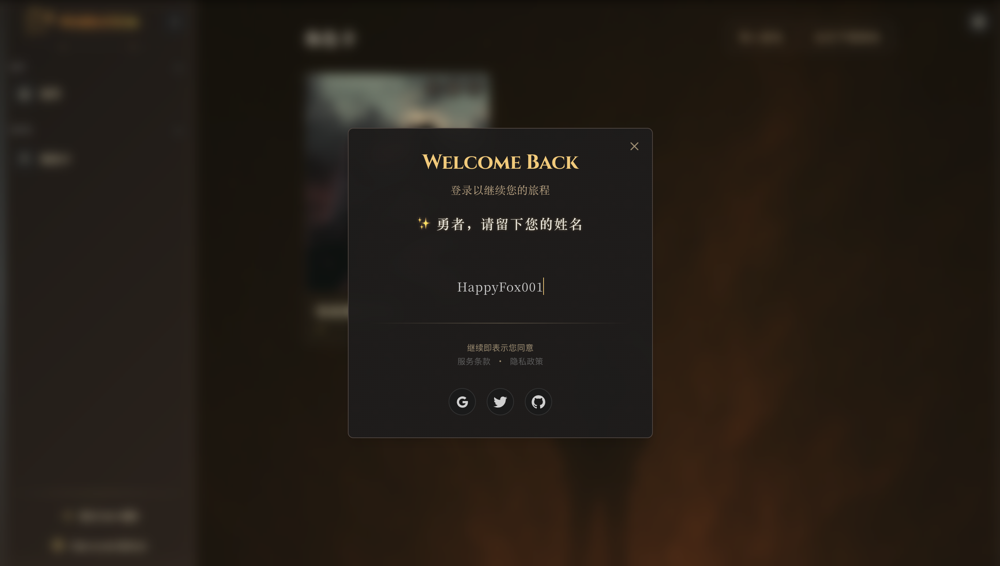
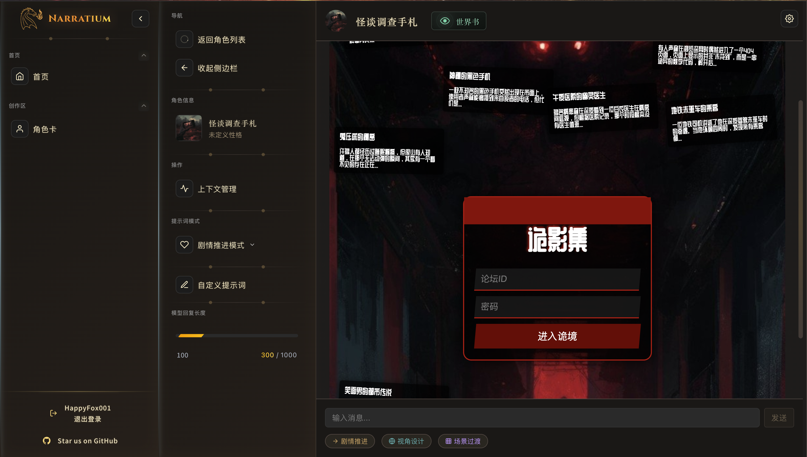
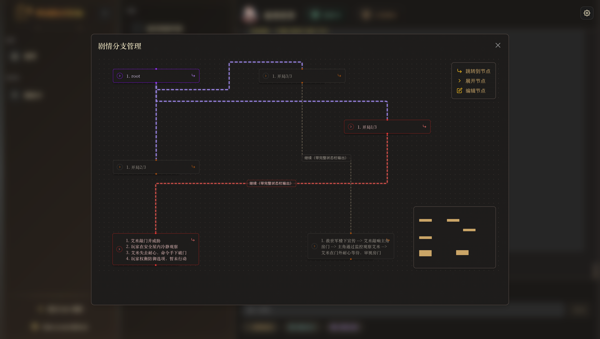
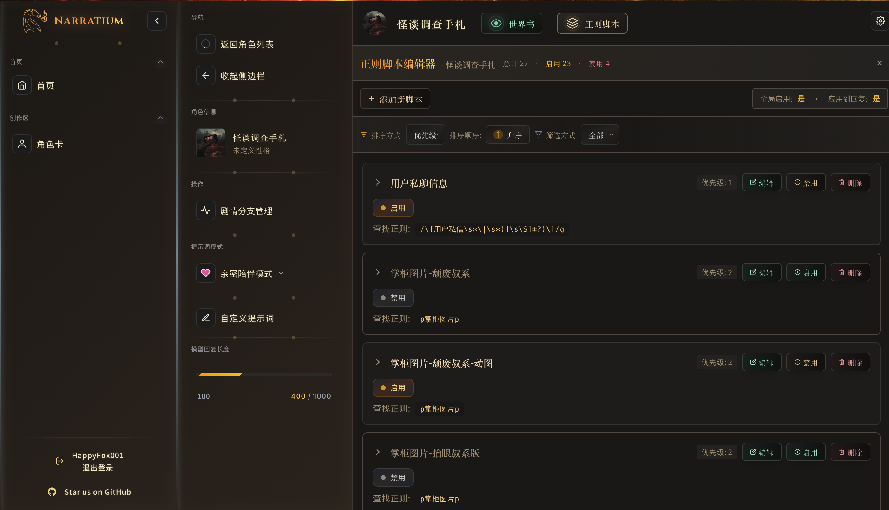

# Narratium

> **The world is vast, let imagination lead**


## Quick Access

- 🔗 [Live Demo](https://narratium.org)
- 📖 [DeepWiki Documentation](https://deepwiki.com/Narratium/Narratium.ai/)
- 🇨🇳  [中文文档](./README_ZH.md)
- ⭐ [Give us a Star!](https://github.com/Narratium/Narratium.ai/stargazers)
- 💾 [Download](https://github.com/Narratium/Narratium.ai/releases)

**Narratium** is a universe of free creation and adventure, dedicated to building the "VSCode" of AI Role Play. Here, your imagination will create unprecedented personalized adventures. Whether it's cross-dimensional emotional resonance, polar survival challenges, or the rise and fall of historical dynasties, Narratium.ai will evolve with your every choice, weaving unique legendary stories.

## Product Overview

Narratium aims to deliver a lightweight storytelling engine combining context compression, memory systems, and graph-based knowledge retrieval (Graph-RAG) to ensure character consistency and world coherence in long-form stories, significantly enhancing the immersion and continuity of AI-generated narratives.

## Page Preview

<div align="center">
  <table>
    <tr>
      <td align="center" style="padding: 10px;">
        
        <br/><em>Main Interface</em>
      </td>
      <td align="center" style="padding: 10px;">
        
        <br/><em>Character Card</em>
      </td>
      <td align="center" style="padding: 10px;">
        
        <br/><em>Dialogue Interface</em>
      </td>
    </tr>
    <tr>
      <td align="center" style="padding: 10px;">
        
        <br/><em>Worldbook Editor</em>
      </td>
      <td align="center" style="padding: 10px;">
        
        <br/><em>Story Branch</em>
      </td>
      <td align="center" style="padding: 10px;">
        
        <br/><em>Regex Editor</em>
      </td>
    </tr>
  </table>
</div>

## Getting started & staying tuned with us


## Features

- 🎭 **Immersive Adventure Mode**: Create personalized worlds and make decisions that matter.
- 🧠 **Visual Memory Management**: React Flow-powered session tracing and branching.
- 🧾 **Character Cards & Lore**: Compatible with SillyTavern cards, manage everything in one place.

## Roadmap

Current features include:

* ✅ Import and compatibility with SillyTavern character cards.
* ✅ Centralized character management and state integration.
* ✅ World Book + Regular Expression compatibility.
* ✅ Multi-model support (OpenAI / Ollama).
* ✅ Visual session memory management (React Flow integration).

Planned features:

* 🚧 **Automated Character Card Generator**
  Build an intelligent generator that creates SillyTavern-compatible character cards based on user-provided world and character descriptions.

* 🚧 **Local Data Management via IndexedDB**
  Support automatic RAG (Retrieval Augmented Generation) for enhancing narrative knowledge continuity.

* 🚧 **Epic Narrative Support**
  Enable creation of grand narratives similar to *The Witcher* or *Inheritance Cycle*, providing deeply immersive story experiences.

* 🚧 **Open Community for Sharing Characters & Stories**
  Allow users to upload, share, and discuss character cards and story scripts, fostering an open creative community.

## Getting Started

### Clone the project

```bash
git clone https://github.com/Narratium/Narratium.ai.git
cd Narratium
```

### Install dependencies

```bash
pnpm install
```

### Run the project

```bash
pnpm run dev
```

Visit: [http://localhost:3000](http://localhost:3000)

### Self-packaging

```bash
npm install -g pake-cli
```

For macOS, use the following command:

```bash
pnpm pake-mac
```
For Linux, use the following command:

```bash
pnpm pake-linux
```

For Windows, use the following command:

```bas
pnpm pake-win
```

Solution for "damaged" display after macOS installation: Open the terminal and enter:

```bash
xattr -d com.apple.quarantine /Applications/Narratium.app
```

## Why Narratium?

In the world of AI-powered interactive storytelling, common pain points include:

### SillyTavern

Powerful but overwhelming for beginners. Its complex setups, difficult card formats, and chaotic ecosystem can discourage new players before the adventure begins.

### AI Dungeon

Once a pioneer of infinite storytelling, it now erects walled gardens. Limited contexts, closed models, and lack of world customization restrict true ownership of adventures.

### Narratium changes everything.

We aim to make storytelling both simple and powerful:

* **Beginner-friendly**: Ready to play, intuitive interface, clear adventure, characters, and memory tracking.
* **Open & Extensible**: Open-source with support for any LLM, expandable characters, worlds, and memories.
* **Immersive & Consistent**: Focused on coherent storytelling, world logic, and character consistency, making every adventure a warm, personal, and traceable epic.

## License Overview

This project consists of two distinct parts with independent licenses:

- ✅ Code: MIT License — open for commercial and non-commercial use with attribution.
- 🔒 Content: CC BY-NC-SA 4.0 — non-commercial use only, with attribution and same-license sharing required.

> For full license details, please refer to the [LICENSE.txt](./LICENSE.txt).

## Contact & Support

* GitHub Issues
* QQ & Discord community (coming soon)

Special thanks to the SillyTavern community and countless character card contributors.If you'd like to join the contributor list, please contact: [qianzhang.happyfox@gmail.com](mailto:qianzhang.happyfox@gmail.com)

## Code Contributer

[](https://github.com/Narratium/Narratium.ai/graphs/contributors)

## Cards Contributer

[](https://github.com/Narratium/Narratium.ai/graphs/contributors)

## Others

Belle Cat Preset: Sponsored by @beilusaiying

Official Website Test API Sponsor: [Click Here](https://e.tb.cn/h.hZBJY6FpW1YnBv1?tk=Kj2hVrXdYMv)

## Star Growth

[](https://starchart.cc/Narratium/Narratium.ai)

